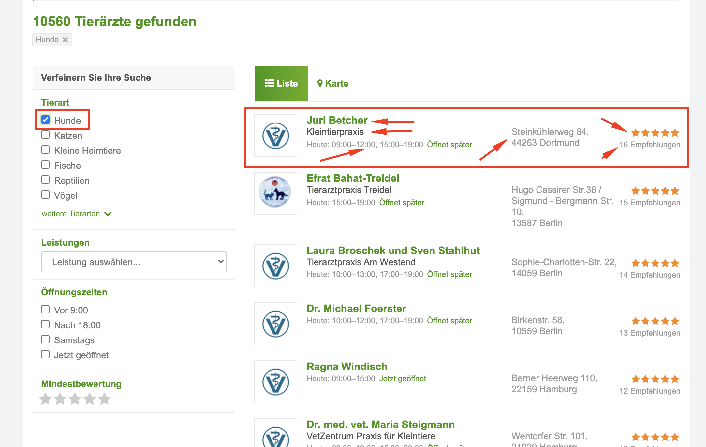

# test_scraping

# Here it`s my implementation of test task

## Task

Collect in csv the data marked in the screenshot from the first 5 pages of issue (100 records).



## How to run
Python3 must be already installed


```shell
git clone https://github.com/Pavilion4ik/test_scraping.git
cd test_scraping
python3 -m venv venv
source venv/bin/activate
pip install -r requirements.txt
python main.py
```